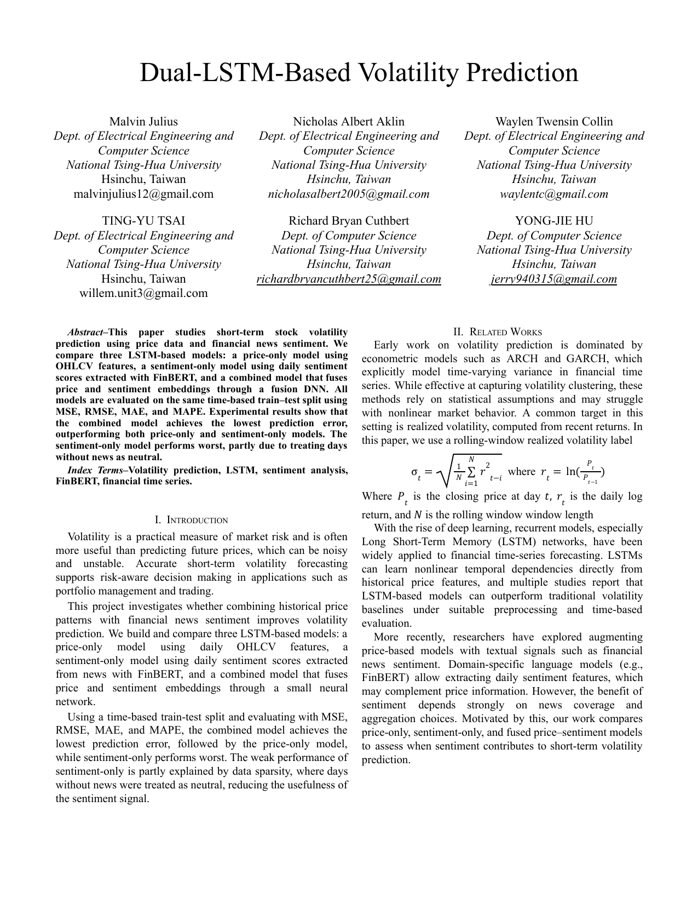
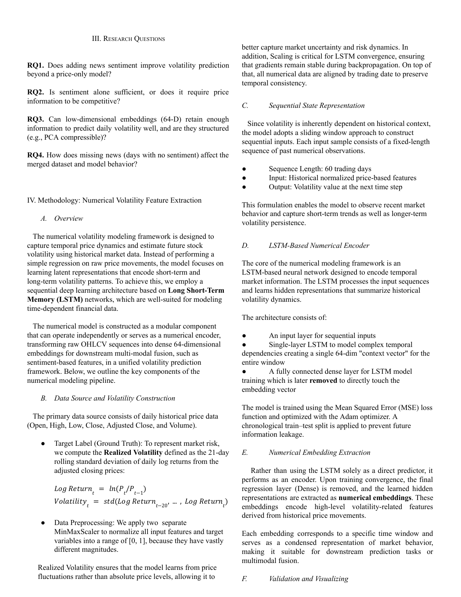
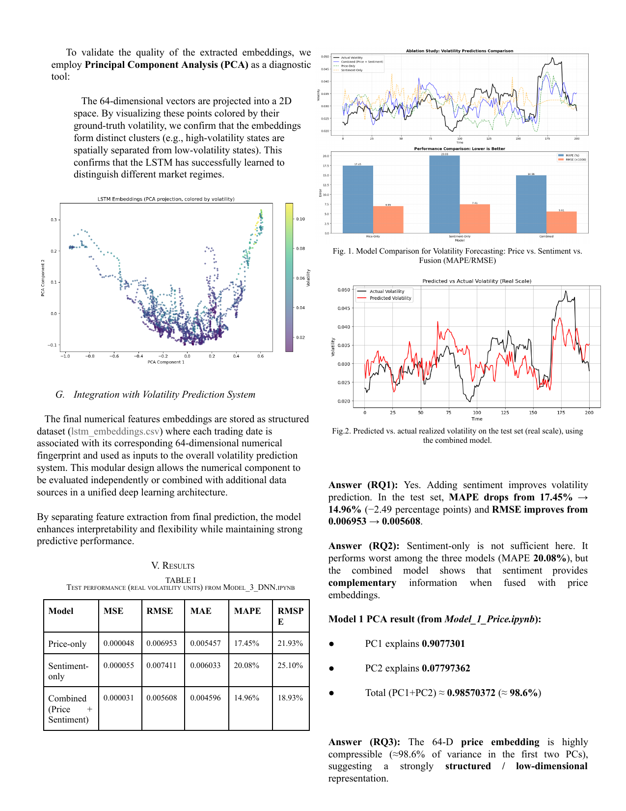
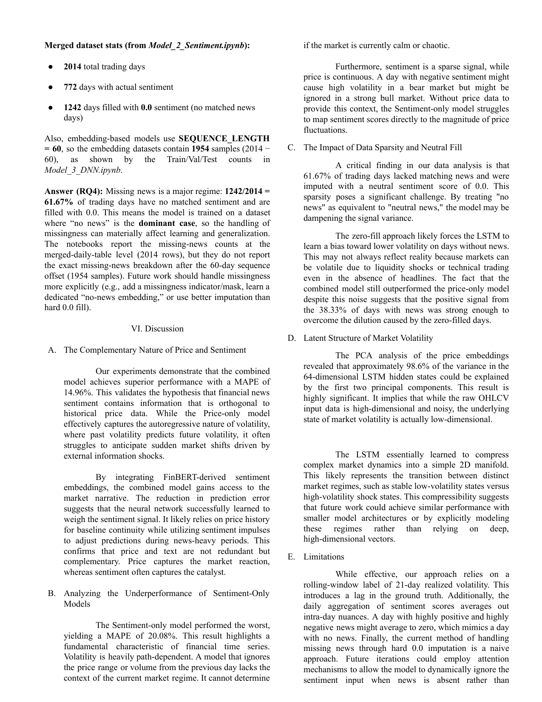
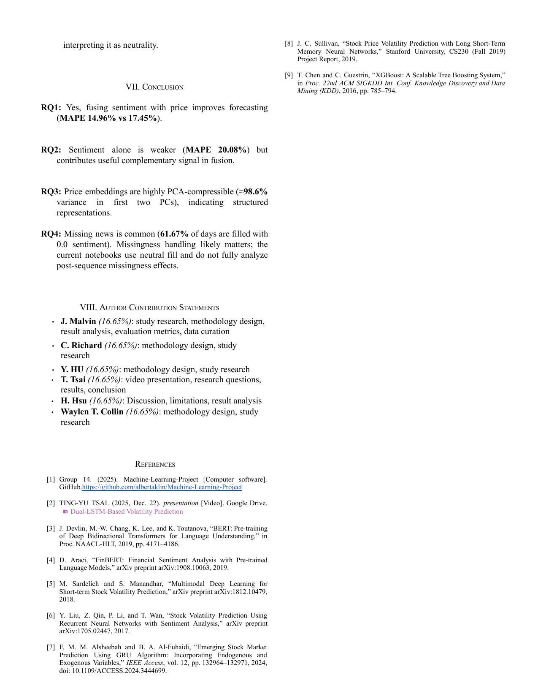

[README.md](https://github.com/user-attachments/files/31239319/README.md)
# Multimodal Stock Volatility Forecasting

A team machine-learning project that compares price-only, news-sentiment-only, and fused price–sentiment models for short-term realized-volatility prediction.

The repository is organized as a portfolio wrapper around the original project files. The submitted notebooks, utility module, datasets, repository README, and final report are preserved byte-for-byte under [`original-project/`](original-project/) and [`docs/`](docs/). No model code or notebook content was rewritten for this portfolio version.


## Full project report

The full report is available as a PDF:

**[Group 14 Final Report](docs/Group%2014%20Final%20Report.pdf)**

The report is also reproduced below for direct viewing.








## My contribution


- research-question formulation;
- results and conclusion development; and
- the project video presentation.

This was a six-person team project. The original contributor list and role allocation are preserved in [`original-project/README.md`](original-project/README.md).

## Repository structure

```text
.
├── README.md
├── REPRODUCIBILITY.md
├── requirements.txt
├── assets/                         # figures extracted from existing notebook outputs
├── docs/
│   └── Group 14 Final Report.pdf   # original report, unchanged
└── original-project/
    ├── Model_1_Price.ipynb
    ├── Model_2_Sentiment.ipynb
    ├── Model_3_DNN.ipynb
    ├── volatility_utils.py
    ├── price_data_raw.csv
    ├── news_data_raw.csv
    └── README.md                    # original repository README, unchanged
```

---

## Contributions
- Malvin Julius malvinjulius12@gmail.com — study research, methodology design, result analysis, evaluation metrics, data curation  
- Richard Bryan Cuthbert richardbryancuthbert25@gmail.com — methodology design, study research  
- Yong-Jie Hu jerry940315@gmail.com — methodology design, study research  
- Ting-Yu Tsai willem.unit3@gmail.com — video presentation, research questions, results, conclusion  
- Nicholas Albert Aklin nicholasalbert2005@gmail.com — discussion, limitations, result analysis  
- Waylen Twensin Collin waylentc@gmail.com — methodology design, study research
