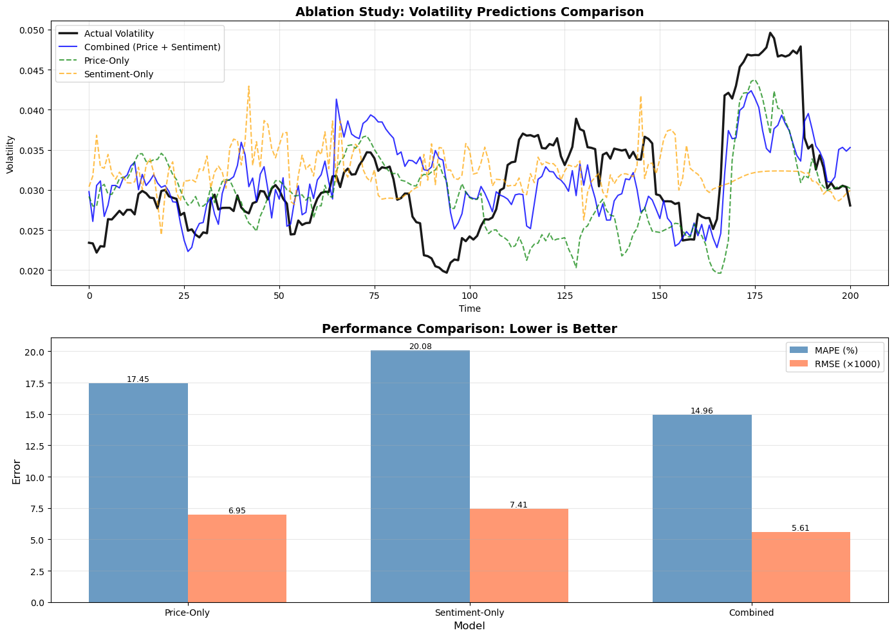
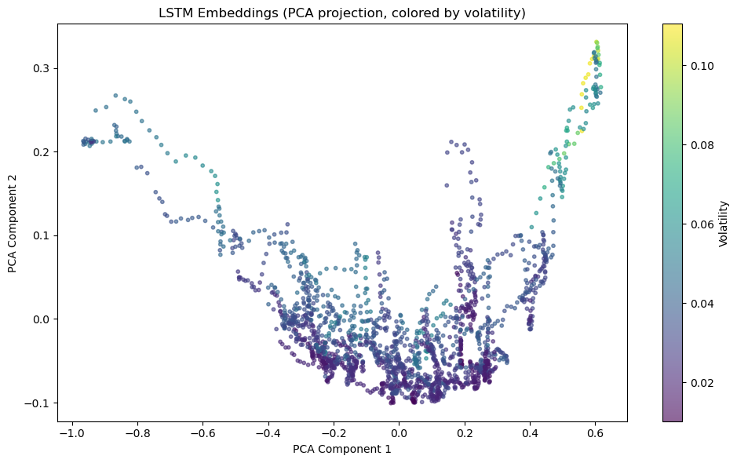

# Multimodal Stock Volatility Forecasting

A team machine-learning project that compares price-only, news-sentiment-only, and fused price–sentiment models for short-term realized-volatility prediction.

The repository is organized as a portfolio wrapper around the original project files. The submitted notebooks, utility module, datasets, repository README, and final report are preserved byte-for-byte under [`original-project/`](original-project/) and [`docs/`](docs/). No model code or notebook content was rewritten for this portfolio version.

> **Project type:** academic team project  
> **Primary topics:** time-series modeling, LSTM embeddings, financial NLP, FinBERT, multimodal fusion, ablation testing

## Project question

Historical prices encode market behavior, while financial news may provide information about external shocks. This project asks whether combining those two sources improves volatility forecasting relative to either source alone.

The pipeline compares:

1. **Price-only model** — a 60-trading-day OHLCV sequence is encoded by an LSTM into a 64-dimensional representation.
2. **Sentiment-only model** — financial-news text is summarized, scored with FinBERT, aggregated by day, and encoded through an LSTM.
3. **Combined model** — 64-dimensional price and sentiment embeddings are processed through separate neural-network branches and fused with learned attention weights.

## Pipeline

```text
price_data_raw.csv
      │
      ├── 21-day rolling volatility label
      └── 60-day OHLCV sequences ──> Price LSTM ──> 64-D price embedding

news_data_raw.csv
      │
      ├── date normalization and text filtering
      ├── extractive summarization
      ├── FinBERT sentiment scoring
      └── daily sentiment sequences ──> Sentiment LSTM ──> 64-D sentiment embedding

64-D price embedding + 64-D sentiment embedding
      └── dual-branch attention DNN ──> predicted realized volatility
```

## Recorded experimental setup

The values below are taken directly from the stored notebook outputs and final report.

| Item | Recorded value |
|---|---:|
| Price rows used after volatility merge | 2,014 |
| Sequence length | 60 trading days |
| Embedding size | 64 dimensions per modality |
| Combined input size | 128 dimensions |
| Training samples | 1,563 |
| Validation samples | 190 |
| Test samples | 201 |
| Combined-model parameters | 44,995 |
| Trading-date range after preprocessing | 2016-02-03 to 2024-02-02 |
| News days matched to trading dates | 772 |
| Trading days filled with neutral sentiment | 1,242 (61.67%) |

The original raw price file contains 13,642 rows spanning 1970-01-02 through 2024-02-02. The notebook filters the modeling period before constructing the final dataset.

## Results

| Model | MSE | RMSE | MAE | MAPE | RMSPE |
|---|---:|---:|---:|---:|---:|
| Price-only | 0.000048 | 0.006953 | 0.005457 | 17.45% | 21.93% |
| Sentiment-only | 0.000055 | 0.007411 | 0.006033 | 20.08% | 25.10% |
| **Combined price + sentiment** | **0.000031** | **0.005608** | **0.004596** | **14.96%** | **18.93%** |

On this stored test split, the combined model reduced MAPE by **2.49 percentage points** relative to the price-only model and by **5.12 percentage points** relative to the sentiment-only model.



The stored PCA output for the 64-dimensional price embedding reports that the first two principal components explain approximately **98.6%** of the variance.



Additional plots extracted from the original notebook outputs are available under [`assets/`](assets/), including prediction traces, residual analysis, training curves, and learned attention weights.

## Interpretation

The experiment supports three conclusions within this dataset and split:

- Price history is more informative than sentiment alone for estimating volatility magnitude.
- News sentiment contributes complementary information when fused with price embeddings.
- Missing-news handling is a central limitation because most trading days were assigned a neutral score of `0.0`.

These findings are experimental results, not evidence of a deployable trading or risk-management system.

## My documented contribution

The original project README records **Ting-Yu Tsai** as contributing to:

- research-question formulation;
- results and conclusion development; and
- the project video presentation.

This was a six-person team project. The original contributor list and role allocation are preserved in [`original-project/README.md`](original-project/README.md).

## Repository structure

```text
.
├── README.md
├── ORIGINAL_FILE_MANIFEST.tsv
├── PRESERVATION_POLICY.md
├── REPRODUCIBILITY.md
├── DATA_AND_PUBLICATION_NOTES.md
├── VERIFICATION.md
├── requirements.txt
├── assets/                         # figures extracted from existing notebook outputs
├── docs/
│   └── Group 14 Final Report.pdf   # original report, unchanged
└── original-project/
    ├── Model_1_Price.ipynb
    ├── Model_2_Sentiment.ipynb
    ├── Model_3_DNN.ipynb
    ├── volatility_utils.py
    ├── price_data_raw.csv
    ├── news_data_raw.csv
    └── README.md                    # original repository README, unchanged
```

## Running the original notebooks

See [`REPRODUCIBILITY.md`](REPRODUCIBILITY.md) for the original run order, generated intermediate files, environment requirements, and known reproducibility constraints.

## Important publication note

The archive contains full financial-news article text and a team report with names and email addresses. Dataset redistribution rights and price-data provenance are not documented in the supplied files. Review [`DATA_AND_PUBLICATION_NOTES.md`](DATA_AND_PUBLICATION_NOTES.md) before making the repository public.

## Scope and limitations

- The evaluation uses one chronological split rather than rolling or walk-forward validation.
- The sentiment pipeline treats unmatched trading days as neutral, which conflates “no news” with neutral news.
- The original archive does not include generated embeddings, saved model checkpoints, or pinned package versions.
- The stored report describes adjusted-close-based volatility, while `volatility_utils.py` computes log returns from the `Close` column. This documentation discrepancy is preserved rather than silently corrected.
- The project predicts a realized-volatility proxy and does not provide investment recommendations.

## Authorship and licensing

This repository contains collaborative academic work and third-party datasets. No open-source license has been added because the supplied archive does not establish that every contributor or data provider authorized relicensing. The source files and report retain their original attribution.
Contributions

- Malvin Julius malvinjulius12@gmail.com — study research, methodology design, result analysis, evaluation metrics, data curation
- Richard Bryan Cuthbert richardbryancuthbert25@gmail.com — methodology design, study research
- Yong-Jie Hu jerry940315@gmail.com — methodology design, study research
- Ting-Yu Tsai willem.unit3@gmail.com — video presentation, research questions, results, conclusion
- Nicholas Albert Aklin nicholasalbert2005@gmail.com — discussion, limitations, result analysis
- Waylen Twensin Collin waylentc@gmail.com — methodology design, study research
